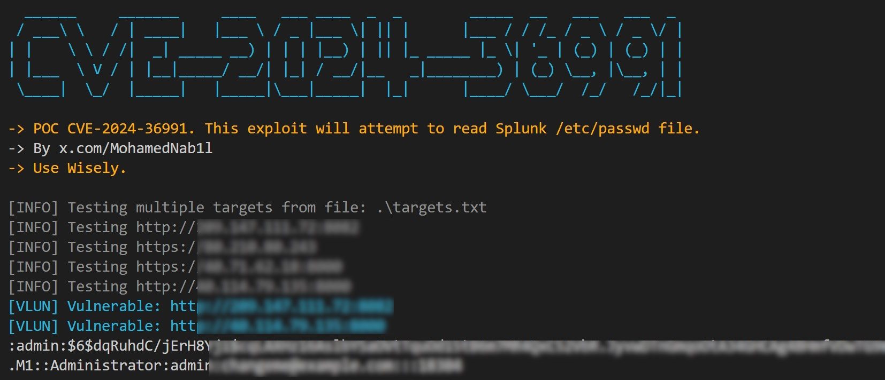

# CVE-2024-36991
POC for CVE-2024-36991: This exploit will attempt to read Splunk /etc/passwd file.





## Overview

This is a bulk scanning and exploitation tool for CVE-2024-36991: Path traversal that affects Splunk Enterprise on Windows versions below 9.2.2, 9.1.5, and 9.0.10. This vulnerability was discovered by [Danylo Dmytriiev](https://x.com/DDV_UA).

## How to Use

### Minimum Requirements

- Python 3.6 or higher
- `requests` library
  
### Single Target:
```sh
python CVE-2024-36991.py -u https://target:9090
```

### Bulk Sscan:
```sh
python CVE-2024-36991.py -f targets.txt
```

## How to Protect Your Splunk Appliance

The vulnerability affects instances with Splunk Web turned on. You could turn Splunk Web off as a possible workaround. See Disable unnecessary Splunk Enterprise components and the web.conf configuration specification file for more information on turning Splunk Web off.


## Contact

For any suggestions or thoughts, please get in touch with [me](https://x.com/MohamedNab1l).


## Disclaimer

I like to create my own tools for fun, work and educational purposes only. I do not support or encourage hacking or unauthorized access to any system or network. Please use my tools responsibly and only on systems where you have clear permission to test.

## References

- https://nvd.nist.gov/vuln/detail/CVE-2024-36991
- https://advisory.splunk.com/advisories/SVD-2024-0711
- https://www.thehackerwire.com/cve-2024-36991-critical-windows-splunk-vulnerability-allows-unauthenticated-access-to-sensitive-files/

